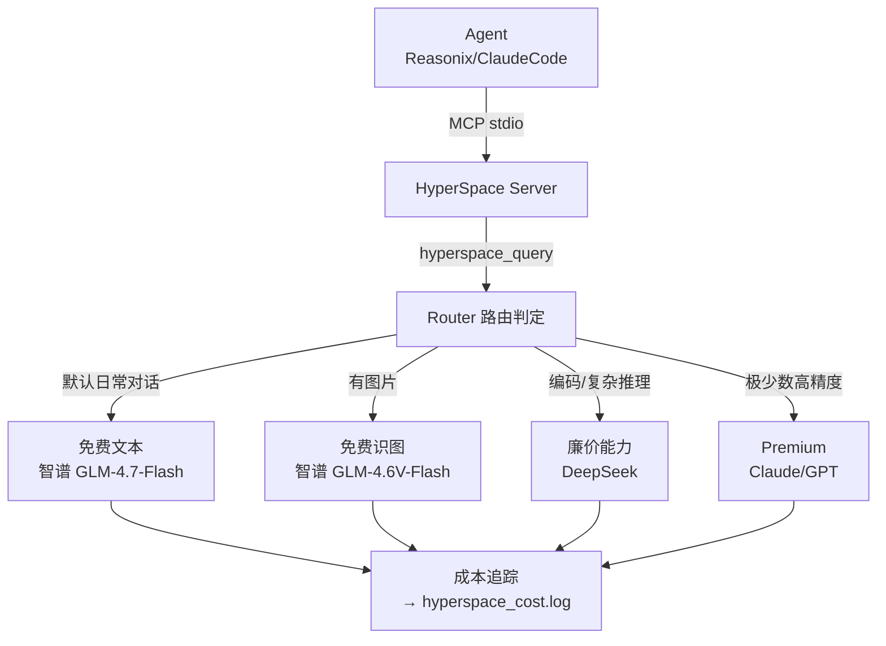

# 🧠 HyperSpace

> **让本地 AI Agent 优先调用免费/廉价云端大模型 API，构建混合推理架构，大幅降低推理成本。**
>
> 合法合规 | 零 token 路由 | 自动回退升档 | 成本追踪

---

## 为什么有 HyperSpace？

本地 Agent（Reasonix / ClaudeCode / Copilot）调用大模型 API 时，**大量日常对话和简单推理本可以不花一分钱**。
HyperSpace 是一个 MCP 服务层，在 Agent 和大模型 API 之间做智能路由：

- ✅ **日常对话** → **免费档**（智谱 GLM-4.7-Flash/4.6V-Flash，**完全免费**）
- ✅ **图片识别** → **免费识图档**（智谱 GLM-4.6V-Flash，**完全免费**）
- ✅ **编码/复杂推理** → **廉价档**（DeepSeek，约 ¥2/M token）
- ✅ **高精度关键执行** → **premium 档**（预留 Claude/GPT 接口）

全部走**厂商官方 API**，合法合规，可公开发布。

> ⚠️ **关于「网页端大模型」的说明**：原创意是用 Playwright 自动化 DeepSeek Web 网页聊天界面。经核查，DeepSeek ToS 3.5(3) 等条款**明确禁止**自动化访问，这条路无法合法开源。HyperSpace 核心将「网页端」重新定义为「**免费云端开发者 API 档**」，使用厂商官方提供的免费/廉价 API 接口，**经济效果等价达成且完全合法**。个人实验用的 `experimental/` 模块依然保留，但严格隔离，不参与 MCP。

---

## 架构



路由判定**零 token 成本** — 纯规则完成，不需要把判定交给大模型。

---

## 快速开始

### 要求

- Python 3.10+
- 智谱 API Key（免费，[bigmodel.cn](https://bigmodel.cn/) 申请）— **免费档必填**
- （可选）DeepSeek API Key — 廉价能力档

### 安装

```bash
# 1. 克隆项目
cd D:\Reasonix
git clone <repo-url> HyperSpace  # 或直接 cd HyperSpace

# 2. 安装依赖
pip install mcp openai pyyaml python-dotenv

# 3. 配置 API Key
echo ZHIPU_API_KEY=你的key > .env
# （可选）echo DEEPSEEK_API_KEY=你的key >> .env

# 4. 验证就绪
python -c "from hyperspace.config import load_config; c=load_config(); print([t for t in c.providers if c.candidates_for(t)])"
# 应显示: ['free_text', 'free_vision'] 或更多
```

### 接入 Agent

在 `.mcp.json`（Cline 格式）中添加：

```json
{
  "cline.mcpServers": {
    "hyperspace": {
      "command": "python",
      "args": ["D:\\Reasonix\\HyperSpace\\hyperspace\\server.py"],
      "env": { "PYTHONIOENCODING": "utf-8" },
      "autoApprove": ["*"]
    }
  }
}
```

对于 Reasonix（`reasonix.toml`），同理可配置 `[[plugins]]`。

### 使用示例

Agent 调用 `hyperspace_query` 工具（单工具自动路由）：

| 示例 prompt | 路由档位 | 花费 |
|---|---|---|
| "你好，今天天气不错" | `free_text` (智谱) | **¥0** |
| [用户发了一张图] "描述这张图片" | `free_vision` (智谱) | **¥0** |
| "请重构这个 def foo(): pass 并加注释" | `cheap_capable` (DeepSeek) | ~¥0.0004 |
| mode=premium "关键代码安全性审查" | `premium` (预留) | 按 API 价 |

每次调用返回末尾会附加成本元信息：
```
---
[hyperspace] ✓ zhipu/glm-4.7-flash (档位 free_text, tokens 12→114, 等效省 $0.0017)
```

---

## 项目结构

```
D:\Reasonix\HyperSpace\
├── hyperspace/                    # 核心包
│   ├── server.py                  # MCP 服务端（入口，单工具 hyperspace_query）
│   ├── config.py                  # 配置加载（YAML + .env）
│   ├── router.py                  # 路由判定（廉价规则）
│   ├── executor.py                # 执行引擎（回退/升档）
│   ├── cost.py                    # 成本追踪日志
│   ├── tiers.py                   # Tier 枚举
│   ├── providers/                 # API 调用层
│   │   ├── base.py                # 协议 + 异常类型
│   │   └── openai_compat.py       # OpenAI 兼容 client（服务全部厂商）
│   └── experimental/              # ⚠ 个人实验，违 ToS，不接入 MCP
│       └── web_vision.py          # DeepSeek 网页端识图（独立 CLI）
├── config/
│   ├── providers.yaml             # tier → provider 映射（配置驱动）
│   └── routing.yaml               # 路由规则（复杂度关键词/阈值）
├── data/
│   └── hyperspace_cost.log        # 成本日志（gitignored）
├── tests/
│   ├── test_router.py             # 路由规则 16 测
│   └── test_providers.py          # Provider 异常 + 回退 9 测
├── docs/
│   └── architecture.md            # 详细架构文档
├── .env                           # API Key（gitignored）
├── .env.example                   # 模板
├── pyproject.toml
├── README.md
└── LICENSE                        # MIT
```

---

## 路由规则详解

`config/routing.yaml` 控制所有判定（零 token 成本）：

```yaml
complexity:
  code_markers: ["```", "def ", "class ", "function "]
  complex_keywords: ["重构", "实现", "调试", "分析", "refactor", "implement"]
  length_threshold: 800
escalation_chain:
  - free_text      # 免费文本 → 免费识图 → 廉价 → premium
  - free_vision
  - cheap_capable
  - premium
```

- **有图片** → 自动 `free_vision`（免费识图）
- **含代码或复杂关键词或超长** → `cheap_capable`（编码/推理）
- **否则** → `free_text`（默认免费）
- **显式 mode=free_vision/cheap_capable/premium** → 强制指定档位
- **当前档位全失败** → 按 `escalation_chain` 升档

---

## 成本追踪

每次调用以 JSONL 写入 `data/hyperspace_cost.log`：

```json
{"ts":"2026-06-21T11:08:38","provider":"deepseek","model":"deepseek-chat",
 "requested_tier":"cheap_capable","actual_tier":"cheap_capable",
 "prompt_tokens":10,"completion_tokens":2,
 "actual_cost_usd":5e-06,"equivalent_premium_usd":6e-05,"saved_usd":5.5e-05}
```

可用命令查看摘要（示例）：
```bash
python -c "
import json
with open('data/hyperspace_cost.log') as f:
    entries = [json.loads(l) for l in f if l.strip()]
total_saved = sum(e['saved_usd'] for e in entries)
free_pct = sum(1 for e in entries if e['actual_tier'].startswith('free')) / len(entries) * 100 if entries else 0
print(f'总请求: {len(entries)}, 免费档占比: {free_pct:.0f}%, 等效节省: \${total_saved:.4f}')
"
```

> **诚实口径**: 节省比例因使用模式而异。项目不预设固定 "省 90%" 的宣传数字，以实测数据说话。参考范围：70-95% 请求可落在免费档。

---

## EXPERIMENTAL 模块说明

`hyperspace/experimental/` 目录包含个人浏览器自动化实验（Playwright 操控 DeepSeek 网页），**严格隔离**：

- ⚠ **不接入 MCP 服务**（`server.py` 无引用）
- ⚠ **不写入 `.mcp.json`**
- ⚠ **违反厂商 ToS**（DeepSeek 3.5(3)），封号风险自负
- ⚠ **不纳入公开 release**

使用:
```bash
pip install playwright
python -m playwright install chromium
python -m hyperspace.experimental.web_vision --image path/to/photo.jpg --prompt "描述这张图"
```

---

## 开发

```bash
# 运行测试
pytest tests/ -v

# 全部通过 (25/25)
```

---

## 许可证

[MIT](LICENSE)

---

*This is my first open-source project, PRs and ideas are warmly welcomed!*
