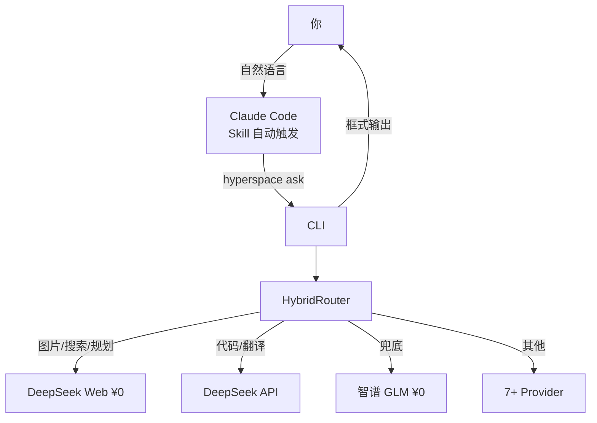

<p align="center">
  
</p>

# HyperSpace — 免费推理 CLI

[](https://github.com/freerunningkid/HyperSpace/actions/workflows/tests.yml)
[](https://www.python.org/)
[](LICENSE)
[](.claude/skills/hyperspace/SKILL.md)

**把 chat.deepseek.com 的免费网页端变成本地 CLI。智能路由到 ¥0 Provider，自动降级。**

---

## 📋 项目简介

本地 Agent 调用大模型 API 时，大量日常问答和简单推理本可以不花一分钱。HyperSpace 是一个 **CLI 工具 + Claude Code Skill**，把 DeepSeek Web、智谱 GLM、SiliconFlow 等免费模型能力抽象成一条命令：

```bash
hyperspace ask "搜索今天的 AI 新闻" --search
```

> **核心创新**: 独立实现 DeepSeek Web 内部 API 调用链（PoW 求解、SSE 流、文件上传），Python 自包含，**零外部依赖**。

---

## ⚡ 快速安装

**要求:** Python 3.10+，一个免费智谱 API Key（[bigmodel.cn](https://bigmodel.cn/) 申请）

```bash
# 1. 克隆
git clone https://github.com/freerunningkid/HyperSpace.git
cd HyperSpace

# 2. 安装
pip install -e ".[dev]"

# 3. 配置 Key
cp .env.example .env
# 编辑 .env，填入 ZHIPU_API_KEY（免费兜底，必填）

# 4. 验证就绪
hyperspace info
```

> **💡 纯白嫖模式**: 安装 Playwright + 登录 chat.deepseek.com 后提取凭据，开启全部 ¥0 能力：
> ```bash
> pip install playwright && playwright install chromium
> chrome.exe --remote-debugging-port=9222  # 调试模式启动 Chrome
> # 登录 chat.deepseek.com，然后：
> python -m hyperspace.hybrid_engine.web_auth --extract
> ```

---

## 🚀 CLI 使用

```bash
# 一问一答
hyperspace ask "量子计算是什么？"                        # 默认 ¥0 Web
hyperspace ask "搜索 AI 最新进展" --search                # 联网搜索
hyperspace ask "这张图里有什么" --image screenshot.png     # 识图
hyperspace ask "用 Python 写快速排序"                      # 编程
hyperspace ask "帮我规划学习计划" --web-mode expert        # 专家模式

# 交互式对话（输入 /bye 退出，/new 重置）
hyperspace chat

# 系统信息 / 成本
hyperspace info
hyperspace summary
```

输出自动带框分隔，和 Claude 的回复明显区分：

```
╔══════════════════════════════════════════════════════════╗
║ 🌐 DeepSeek Web (¥0)                                     ║
╚══════════════════════════════════════════════════════════╝
<回答内容>
```

---

## 🎯 Claude Code 自动触发

安装后自动注册 `hyperspace` skill。**不需要手动调**，正常聊天即可触发：

| 你说 | 自动触发 |
|------|----------|
| "搜索一下今天的 AI 新闻" | → `hyperspace ask ... --search` |
| 发了截图问"这是什么" | → `hyperspace ask ... --image <path>` |
| "帮我规划学习计划" | → `hyperspace ask ... --web-mode expert` |
| "翻译这段文字成英文" | → `hyperspace ask ...` |
| "写个 Python 脚本" | → `hyperspace ask ...` |
| "克隆仓库 / 改代码 / git" | → **不触发**，本地处理 |

---

## 🧠 路由引擎

| 引擎 | 成本 | 实现 | 适用场景 |
|------|------|------|----------|
| **DeepSeek Web** | **¥0** | 原生 Python (PoW + SSE + 文件上传) | 问答、搜索、识图、规划、长文本 |
| **DeepSeek API** | ~¥2/M token | OpenAI 兼容 API | 代码、翻译、结构化输出 |
| **智谱 GLM** | **¥0** | OpenAI 兼容 API | 兜底 |
| **SiliconFlow** | **¥0** | OpenAI 兼容 API | 文本生成 |
| **Agnes** | **¥0** | OpenAI 兼容 API | 文本 / 图片 / 视频 |
| **Qwen** | 低 | OpenAI 兼容 API | 文本 / 识图 |

### 路由优先级（auto 模式）

| 条件 | 路由到 | 理由 |
|------|--------|------|
| 有图片 / 需搜索 / 规划 / 长文本 | **DeepSeek Web ¥0** | 原生能力 |
| 代码 / 翻译 / 结构化输出 | **DeepSeek API** | 输出稳定 |
| 默认 | **DeepSeek Web ¥0** | 经济优先 |
| 降级链 | Web → API → 智谱 → SiliconFlow → Agnes | 逐级兜底 |

### 模式覆盖

| 参数 | 值 | 行为 |
|------|-----|------|
| `--mode` | `auto` / `force_web` / `force_api` / `force_zhipu` | 选择执行器 |
| `--web-mode` | `auto` / `quick` / `expert` / `vision` | DeepSeek Web 内部产品模式 |
| `--search` | 无值 | 启用联网搜索 |

---

## 📁 项目结构

```
HyperSpace/
├── hyperspace/                   # 核心包
│   ├── cli.py                    # CLI 入口 (ask/chat/info/summary)
│   ├── server.py                 # MCP 兼容旧入口
│   ├── hybrid_engine/            # 混合推理引擎
│   │   ├── deepseek_web_client.py   # PoW + SSE + 文件上传
│   │   ├── hybrid_router.py         # 8 级路由决策
│   │   ├── task_analyzer.py         # 规则分析（零 token）
│   │   ├── context_window_manager.py# 会话追踪 + 压缩
│   │   ├── health_checker.py        # 异步健康探测
│   │   ├── fallback.py              # 指数退避降级
│   │   ├── result_processor.py      # 思维链提取
│   │   └── web_auth.py              # 浏览器凭据提取
│   ├── providers/                # 多 Provider 注册表
│   │   ├── base.py, registry.py, capabilities.py
│   │   ├── deepseek_web.py, deepseek_api.py
│   │   ├── zhipu_api.py, qwen_api.py
│   │   ├── siliconflow, agnes, chatglm_web...
│   │   └── openai_compatible.py
│   ├── cost.py                   # 成本追踪
│   └── info.py / summary.py      # 系统信息
├── config/                       # YAML 配置
│   ├── providers.yaml            # 7+ Provider 注册
│   ├── routing.yaml              # 路由规则
│   └── hybrid_config.yaml        # 混合引擎配置
├── tests/                        # 225 测试（零网络依赖）
├── .claude/skills/hyperspace/    # Claude Code Skill
├── VERSION
└── pyproject.toml
```

---

## 🛡️ 安全说明

- **无硬编码密钥** — 所有 API Key 从 `.env` 读取
- **敏感文件已 gitignore** — `.env`、`data/*.json`、`data/*.log` 均不提交
- **成本日志透明** — 每次调用记录 provider/token/花费，不预设"省 90%"宣传口径

---

## 🔧 开发

```bash
pytest tests/ -v              # 225 单元测试，零网络依赖
python -m hyperspace.info     # 查看 Provider 健康状态
python -m hyperspace.summary  # 成本摘要
```

---

## 🧩 架构图



---

## 📜 许可证

[MIT](LICENSE) © 2026 freerunningkid

---

*我的第一个开源项目，PR 和想法热烈欢迎！*
