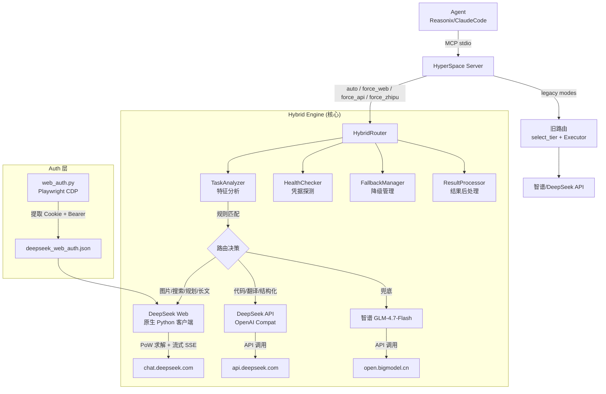

<p align="center">
  
</p>

# 🧠 HyperSpace — 混合推理引擎 v2.0 (原生实现)

[](https://github.com/freerunningkid/HyperSpace/actions/workflows/tests.yml)
[](https://www.python.org/)
[](LICENSE)
[](https://modelcontextprotocol.io/)

> **让本地 AI Agent 优先调用 DeepSeek Web (¥0, 原生 Python 客户端) ⊗ DeepSeek API (低成本) → 智谱 GLM (免费兜底) 的三层混合推理架构。**
>
> 不依赖任何外部服务 | 智能路由 | PoW 自动求解 | 自动降级 | 成本追踪 | 202 单元测试

---

## 为什么有 HyperSpace？

本地 Agent（Reasonix / ClaudeCode / Copilot）调用大模型 API 时，**大量日常对话和简单推理本可以不花一分钱**。
HyperSpace 是一个 MCP 服务层，在 Agent 和大模型之间做智能路由：

### 三层混合引擎（原生实现）

| 层 | 引擎 | 成本 | 实现方式 | 适用场景 |
|---|---|---|---|---|
| 🥇 **主力** | DeepSeek Web | **¥0** | 原生 Python 客户端 (PoW + 内部 API) | 规划、搜索、识图、长文本 |
| 🥈 **辅力** | DeepSeek API | ~¥2/M token | OpenAI 兼容 API 调用 | 代码生成、翻译、结构化输出 |
| 🥉 **兜底** | 智谱 GLM | **¥0** | OpenAI 兼容 API 调用 | 前两者都不可用 |

> **核心创新**: 不依赖 OpenClaw / FreeLLMAPI 等外部服务。我们独立实现了 DeepSeek Web 的内部 API 调用（PoW 挑战求解、会话管理、流式对话、文件上传），Python 代码自包含，零外部依赖。

### 架构图



路由判定**零 token 成本** — 纯关键词+规则完成，不需要把判定交给大模型。

---

## 快速开始

### 要求

- Python 3.10+
- 智谱 API Key（免费，[bigmodel.cn](https://bigmodel.cn/) 申请）— **兜底必填**
- （推荐）DeepSeek API Key — 辅力层
- （可选）Chrome 浏览器 — DeepSeek Web 主力层需登录一次

### 安装

```bash
# 1. 克隆项目
git clone https://github.com/freerunningkid/HyperSpace.git
cd HyperSpace

# 2. 安装依赖
pip install -e ".[dev]"

# 3. （可选）安装 Playwright + Chromium — 用于提取 DeepSeek Web 登录凭据
pip install playwright
playwright install chromium

# 4. 配置 API Key
cp .env.example .env
# 编辑 .env 填入 ZHIPU_API_KEY（必填）和 DEEPSEEK_API_KEY（推荐）

# 5. 提取 DeepSeek Web 凭据 (可选, 但启用后搜索/规划/识图/长文全部 ¥0)
#    以调试模式启动 Chrome:
#    chrome.exe --remote-debugging-port=9222
#    在 Chrome 中登录 https://chat.deepseek.com
#    然后运行:
python -m hyperspace.hybrid_engine.web_auth --extract

# 6. 验证就绪
python -c "from hyperspace.config import load_config; c=load_config(); print([t for t in c.providers if c.candidates_for(t)])"
```

### 接入 Agent

HyperSpace 是标准 MCP stdio 服务。在你的 Agent 的 MCP 配置中添加：

```json
{
  "mcpServers": {
    "hyperspace": {
      "command": "python",
      "args": ["path/to/HyperSpace/hyperspace/server.py"],
      "env": { "PYTHONIOENCODING": "utf-8" },
      "autoApprove": ["*"]
    }
  }
}
```

> `path/to/HyperSpace` 替换为你实际的克隆路径。Claude Code 用户将上述配置写入项目根目录的 `.mcp.json`。

### 接入 Agent

HyperSpace 是标准 MCP stdio 服务，兼容所有支持 MCP 协议的 Agent（Claude Code / VS Code Copilot / Cline / Roo Code 等）。

在你的 MCP 配置文件中添加：

```json
{
  "mcpServers": {
    "hyperspace": {
      "command": "python",
      "args": ["path/to/HyperSpace/hyperspace/server.py"],
      "env": { "PYTHONIOENCODING": "utf-8" },
      "autoApprove": ["*"]
    }
  }
}
```

> `path/to/HyperSpace` 替换为你的实际克隆路径。

### 使用示例

Agent 调用 `hyperspace_query` 工具：

| 示例 prompt | 路由引擎 | 花费 |
|---|---|---|
| "帮我制定一个学习计划" | **DeepSeek Web** (原生客户端, 规划) | **¥0** |
| [用户发了一张图] "描述这张图片" | **DeepSeek Web** (原生识图) | **¥0** |
| "用 Python 写快速排序" | **DeepSeek API** (代码生成) | ~¥0.0004 |
| "翻译这段文字成英文" | **DeepSeek API** (翻译) | ~¥0.0001 |
| "你好，今天天气不错" | **DeepSeek Web** (简单问答) | **¥0** |
| mode=force_zhipu "..." | **智谱 GLM-4.7-Flash** | **¥0** |

每次调用返回末尾会附加引擎元信息：
```
---
[hyperspace] 引擎: deepseek_web/deepseek-chat  规划: (思维链摘要)
```

---

## 项目结构

```
HyperSpace/
├── hyperspace/                          # 核心包
│   ├── server.py                        # MCP 服务端（双路径：混合引擎 + 旧路由）
│   ├── config.py                        # 配置加载（YAML + .env）
│   ├── router.py                        # 旧路由判定（保留兼容 legacy mode）
│   ├── executor.py                      # 旧执行引擎（保留兼容 legacy mode）
│   ├── cost.py                          # 成本追踪日志
│   ├── tiers.py                         # Tier 枚举
│   ├── hybrid_engine/                   # 🆕 混合推理引擎（核心创新）
│   │   ├── __init__.py
│   │   ├── task_analyzer.py             # 任务特征分析（关键词/正则）
│   │   ├── health_checker.py            # 服务健康探测（凭据检查 + API 探测）
│   │   ├── hybrid_router.py             # 核心路由决策（8 级优先级 + 降级链）
│   │   ├── deepseek_web_client.py       # 🆕 DeepSeek Web 原生客户端（PoW + SSE 流）
│   │   ├── web_auth.py                  # 🆕 浏览器凭据提取（Playwright CDP）
│   │   ├── result_processor.py          # 结果后处理（思维链提取）
│   │   └── fallback.py                  # 降级管理（指数退避重试）
│   ├── providers/                       # API 调用层
│   │   ├── base.py                      # 协议 + 异常类型
│   │   └── openai_compat.py             # OpenAI 兼容 client
│   └── experimental/                    # 个人实验（严格隔离）
├── config/
│   ├── providers.yaml                   # tier → provider 映射
│   ├── routing.yaml                     # 旧路由规则
│   └── hybrid_config.yaml               # 🆕 混合引擎配置
├── data/
│   ├── hyperspace_cost.log              # 成本日志（gitignored）
│   └── deepseek_web_auth.json           # 🆕 Web 凭据（gitignored）
├── tests/
│   ├── test_router.py                   # 旧路由规则测试（16 用例）
│   ├── test_providers.py                # Provider 异常 + 回退测试（9 用例）
│   └── test_hybrid_engine.py            # 🆕 混合引擎测试（39 用例）
├── docs/
│   └── architecture.md
├── pyproject.toml
├── README.md
└── LICENSE                              # MIT
```

---

## 路由规则详解

### 混合引擎路由（auto 模式）

优先级从高到低：

| 条件 | 路由到 | 理由 |
|---|---|---|
| 有图片 (`has_image`) | **DeepSeek Web** (原生 Python 客户端) | Web 端原生识图 |
| 需要搜索 (`needs_search`) | **DeepSeek Web** | Web 端可联网搜索 |
| 需要规划 (`needs_planning`) | **DeepSeek Web** | 长文本规划能力强 |
| 长文本 (`is_long`, >5000 字符) | **DeepSeek Web** | 1M 上下文窗口 |
| 代码生成 (`needs_coding`) | **DeepSeek API** | API 输出代码更稳定 |
| 翻译 (`needs_translation`) | **DeepSeek API** | 标准化翻译 |
| 结构化输出 (`needs_structured_output`) | **DeepSeek API** | 支持 JSON 模式 |
| 默认（简单问答/闲聊） | **DeepSeek Web** | 经济优先 |

### 显式模式覆盖

| mode | 行为 |
|---|---|
| `auto` | 自动判定（默认） |
| `force_web` | 强制使用 DeepSeek Web (原生客户端) |
| `force_api` | 强制使用 DeepSeek API |
| `force_zhipu` | 强制使用智谱 GLM 兜底 |
| `free_text` / `free_vision` | 旧路由（向后兼容） |

### 降级链

`DeepSeek Web → DeepSeek API → 智谱 GLM → 友好错误提示`

---

## 成本追踪

每次调用以 JSONL 写入 `data/hyperspace_cost.log`：

```json
{"ts":"2026-06-21T11:08:38","provider":"deepseek","model":"deepseek-chat",
 "requested_tier":"cheap_capable","actual_tier":"cheap_capable",
 "prompt_tokens":10,"completion_tokens":2,
 "actual_cost_usd":5e-06,"equivalent_premium_usd":6e-05,"saved_usd":5.5e-05}
```

可用命令查看摘要：
```bash
python -m hyperspace.summary
```

> **诚实口径**: 节省比例因使用模式而异。项目不预设固定 "省 90%" 的宣传数字，以实测数据说话。

---

## DeepSeek Web 原生客户端

`hyperspace/hybrid_engine/deepseek_web_client.py` 是我们独立实现的 DeepSeek Web 内部 API 客户端：

- **PoW 求解**: SHA256 前导零位 PoW，自实现零外部依赖
- **流式对话**: SSE 流解析，支持 streaming 实时返回
- **思维链提取**: 自动分离 reasoning_content 和 text
- **文件上传**: 支持图片上传 + 轮询状态确认
- **会话管理**: 自动创建/复用 chat_session

### 凭据管理

`hyperspace/hybrid_engine/web_auth.py` 通过 Playwright CDP 连接 Chrome：

```bash
# 提取 DeepSeek 登录凭据
# 先在调试模式启动 Chrome:
chrome.exe --remote-debugging-port=9222
# 登录 chat.deepseek.com 后运行:
python -m hyperspace.hybrid_engine.web_auth --extract

# 查看凭据状态:
python -m hyperspace.hybrid_engine.web_auth --status
```

凭据保存到 `data/deepseek_web_auth.json`，含 Cookie + Bearer Token + User-Agent。

---

## 开发

```bash
# 运行全部测试 (202 单元测试, 零网络依赖)
pytest tests/ -v
```

---

## 许可证

[MIT](LICENSE)

---

*This is my first open-source project, PRs and ideas are warmly welcomed!*
